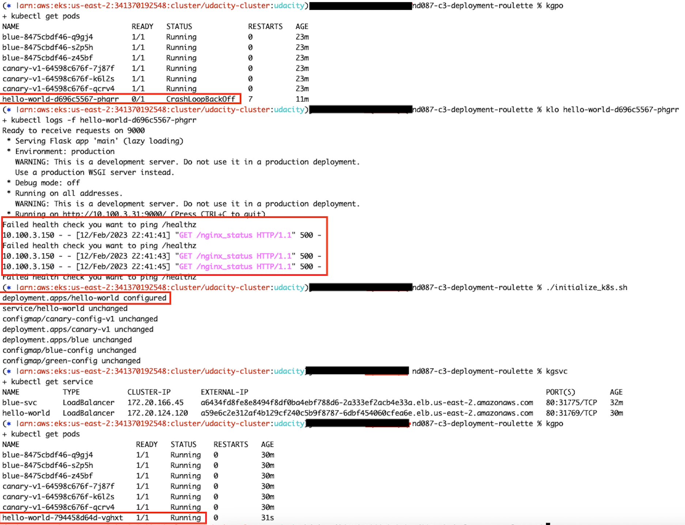
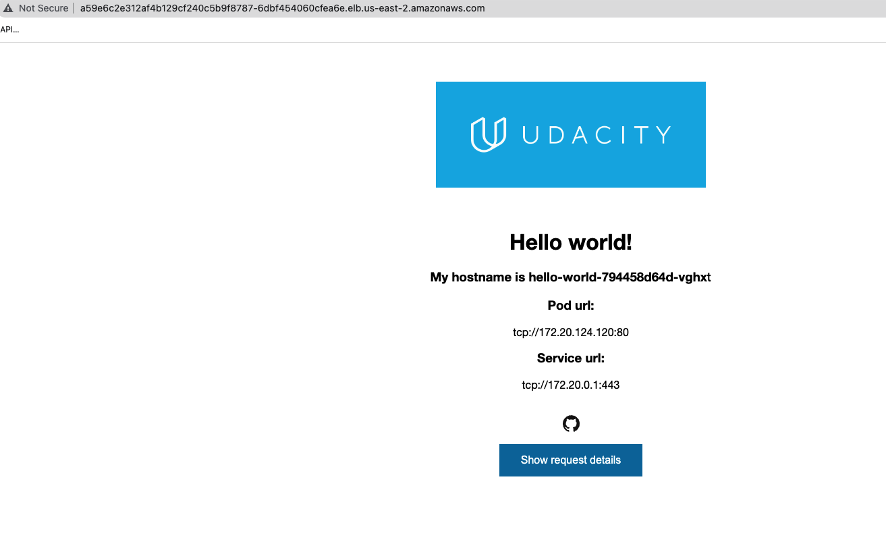

## Deployment Troubleshooting

1. Checked the pod status, found the `hello-world` to be not running.
2. Checked the pod logs and found a failing health check. The name of the health check was not correct.
3. After updating the deployment with the correct health check name, the pod returned to a running state.
Screenshot of commands executed: 
Browse the `hello-world` app: 