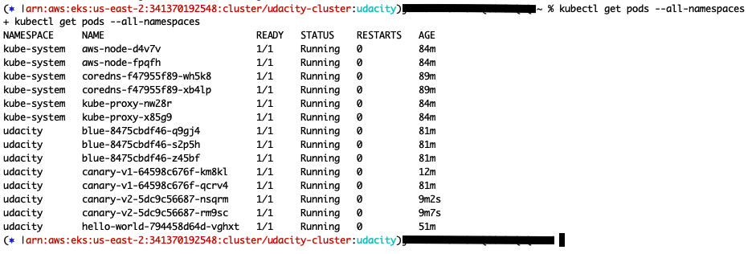

## Canary deployments

1. A working shell script named `canary.sh` can be found in the root directory.
2. `curl` command output is in `canary.txt`.
3. Output of `kubectl get pods --all-namespaces`: 