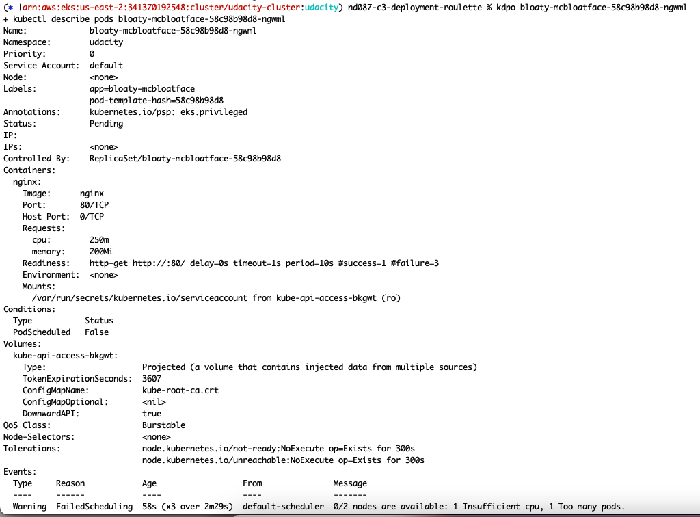

## Node elasticity

1. Application deployed: 
2. Found some pods in pending state:  
3. Not enough nodes/node_capacity available to spin up all the pods: 
4. Modified the EKS terraform config for max and desired number of nodes to 3. TF apply: 
5. After TF apply, the pods were no longer in a pending state: 